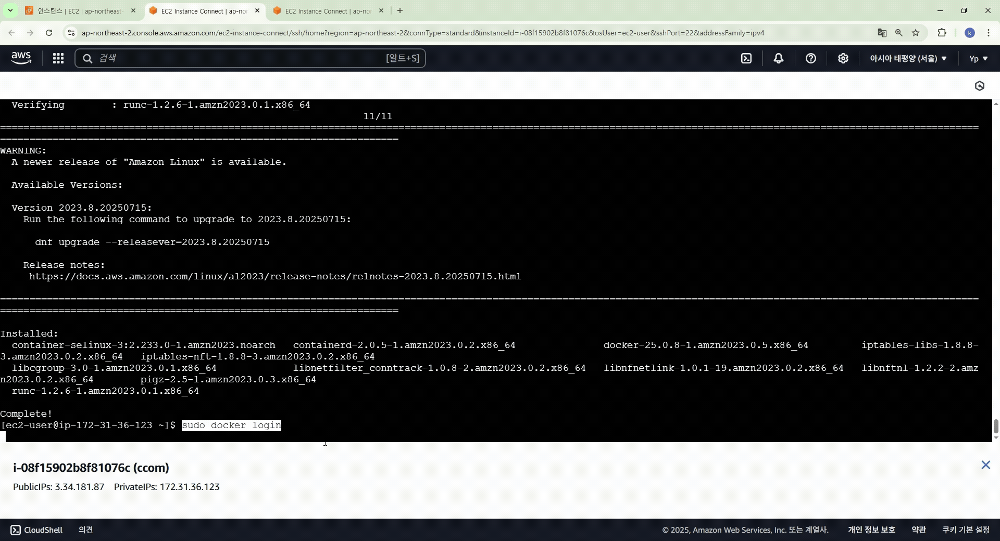

## AWS 배포 가이드

### 1. 인스턴스 만들기

### 2. 인바운드 규칙

### 3. 로컬 주소 변경

### 4. 시스템 업데이트 & Docker 설치

### 5. Docker 로그인 및 서비스 시작

### 6. 도커 네트워크/볼륨 생성

### 7. MySQL 컨테이너 실행 및 DB 세팅

### 8. 애플리케이션 컨테이너 환경변수 적용 실행

### 9. 사이트 접속 및 배포 완료 확인

